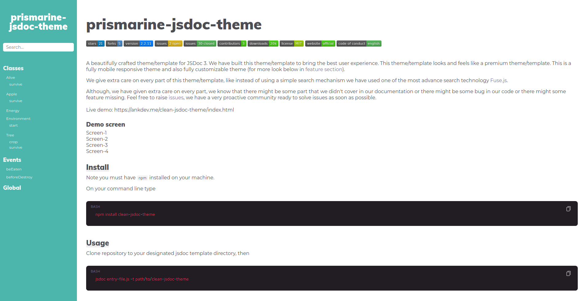
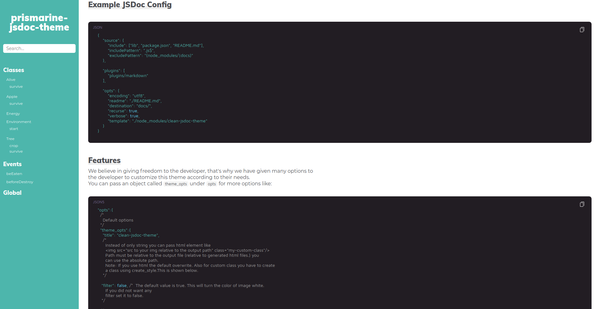
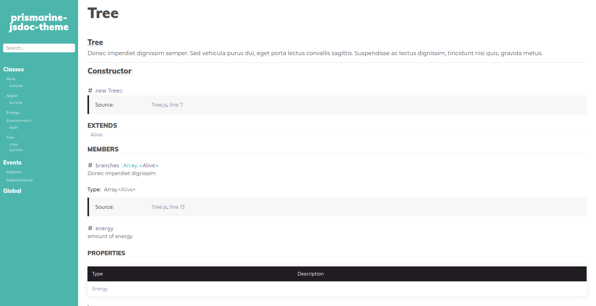
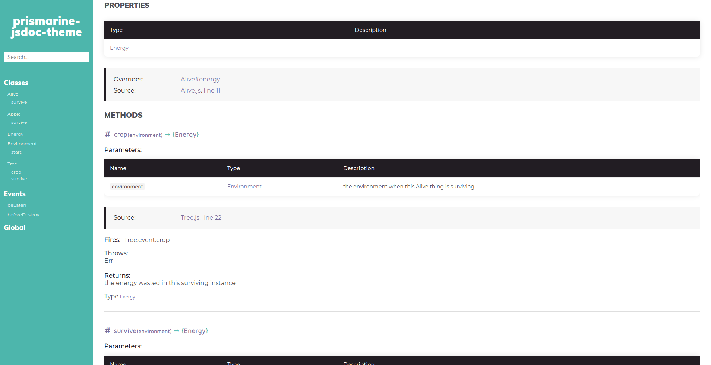

# prismarine-jsdoc-theme
[](https://github.com/ranguli/prismarine-jsdoc-theme) [](https://github.com/ranguli/prismarine-jsdoc-theme/fork)  [](https://github.com/ranguli/prismarine-jsdoc-theme/issues) [](https://github.com/ranguli/prismarine-jsdoc-theme/issues?q=is%3Aissue+is%3Aclosed) [](https://github.com/ranguli/prismarine-jsdoc-theme/graphs/contributors) [](https://www.npmjs.com/package/prismarine-jsdoc-theme) [](https://github.com/ranguli/prismarine-jsdoc-theme/blob/master/LICENSE)

<br>

PrismarineJS theme for JSDoc

### Screenshots





## Install
> Note you must have `npm` installed on your machine.

On your command line type
```bash
npm install prismarine-jsdoc-theme
```

## Usage
Clone repository to your designated jsdoc template directory, then

```bash
jsdoc entry-file.js -t path/to/prismarine-jsdoc-theme
```

## Node.js Dependency
In your projects package.json file add a generate script
```json
"script": {
  "generate-docs": "node_modules/.bin/jsdoc --configure .jsdoc.json --verbose"
}
```

In your `jsdoc.json` file, add a template option.

```json
"opts": {
  "template": "node_modules/prismarine-jsdoc-theme"
}
```


## Example JSDoc Config
```json
{
    "source": {
        "include": ["lib", "package.json", "README.md"],
        "includePattern": ".js$",
        "excludePattern": "(node_modules/|docs)"
    },

    "plugins": [
        "plugins/markdown"
    ],

    "opts": {
        "encoding": "utf8",
        "readme": "./README.md",
        "destination": "docs/",
        "recurse": true,
        "verbose": true,
        "template": "./node_modules/prismarine-jsdoc-theme"
    }
}
```

## Features
We believe in giving freedom to the developer, that's why we have given many options to
the developer to customize this theme according to their needs.
You can pass an object called `theme_opts` under `opts` for more options like:
```json5
"opts":{
  /*
    Default options
  */
  "theme_opts":{
    "title": "prismarine-jsdoc-theme",
    /*
      Instead of only string you can pass html element like
      
      Path must be relative to the output file (relative to generated html files.) you
      can use the absolute path.
      Note: If you use html the default overwrite. Also for custom class you have to create
      a class using create_style.This is shown below.
    */

   "filter": false, /*  The default value is true. This will turn the color of image white.
      If you did not want any
      filter set it to false.
   */

  // Adding additional menu.
  "menu": [
    {
      "title": "Website", //You have to give title otherwise you get error.
      "link": "https://ankdev.me/prismarine-jsdoc-theme/index.html", // You have to give link otherwise you get error.
      // Below properties are optional.
      "target": "_blank",
      "class": "some-class",
      "id": "some-id"
    },
    {
      "title": "Github",
      "link": "https://github.com/ranguli/prismarine-jsdoc-theme/",
      "target": "_blank",
      "class": "some-class",
      "id": "some-id"
    }
  ],

  // You can pass meta options also
  "meta": [
      "<meta name=\"author\" content=\"Ankit Kumar\">",
      "<meta name=\"description\" content=\"Best Clean and minimal JSDoc 3 Template / Theme\">"
    ],

  "search": false, //This option is for either showing or hiding the search. By default it is true.

  // You can create custom style which will overwrite the exisiting class property.
  "create_style": "nav{background: yellow}" +     // This will change the background color of sidebar.
                  ".my-custom-class{ filter: brightness(10) grayscale(100%)}", // This will apply filter to my-custom-class

  //You can add path of your style file. Note it must be relative to your output file. (relative to generated html files.)
  "add_style_path": ["../custom.css"], // Pass array of path or url

  // You can add custom script to html
  "add_scripts": "function foo(){console.log('foo')}",

  // You can add path of your script file. Note it must be relative to your output file. (relative to generated html files.)
  "add_script_path": ["../custom.js"], // Pass array of path or url

  "footer": "This is footer",   // Here again you can pass html element
  }
}
```

## Developing

```bash
git clone https://github.com/ranguli/prismarine-jsdoc-theme.git
cd prismarine-jsdoc-theme
npm install
npm run test
```
`npm run test` will generate files in output folder.

## Contact
Please support the upstream version of this repository, by giving them a <a href="https://github.com/ankitskvmdam/clean-jsdoc-theme" data-icon="octicon-star" aria-label="Star ankitskvmdam/clean-jsdoc-theme on GitHub">star</a>.


## License
Licensed under the MIT license.
